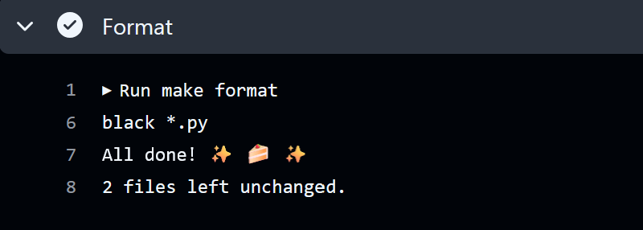
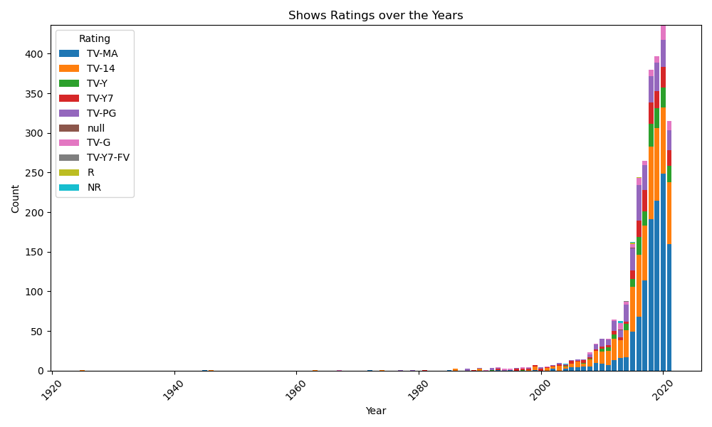
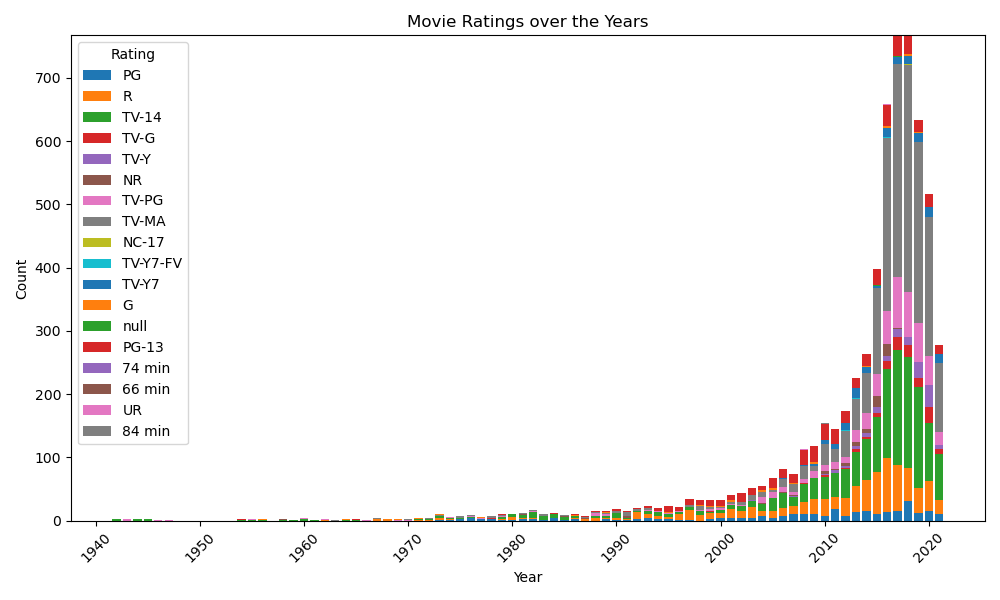

# Netflix Movie and TV Shows Project Overview

## About the Project
The purpose of this project is to generate descriptive statistics with Polars and look into trends of movie and TV show releases on Netflix over the years. 

### Summary Statistics of Movie and TV Show Release Years:

### Visualizations

## Note on the repository and directions:
This project contains:
* requirements.txt detailing the requirements needed for this project
* Makefile to install requirements, lint, format, and test your code
* github actions with separate YAML files for Install, Lint, Format, and Test in the github workflows folder
* DockerFile and devcontainer for environment set up
* Jupyter notebook performing descriptive statistics with Polars
* main.py Python script for statistics and generating data visualizations using Polars
* test_main.py for Python testing scripts
* Summary pdf containing the walkthrough and conclusions found in the data analysis

## Preparation
1. Open codespaces 
2. Load repo to code spaces
2. Wait for installation of all requirements in requirements.txt

## Check format and test errors
1. Format code `make format`

2. Lint code `make lint`

3. Test code `make test`

(alternatively, do all with `make all`)

